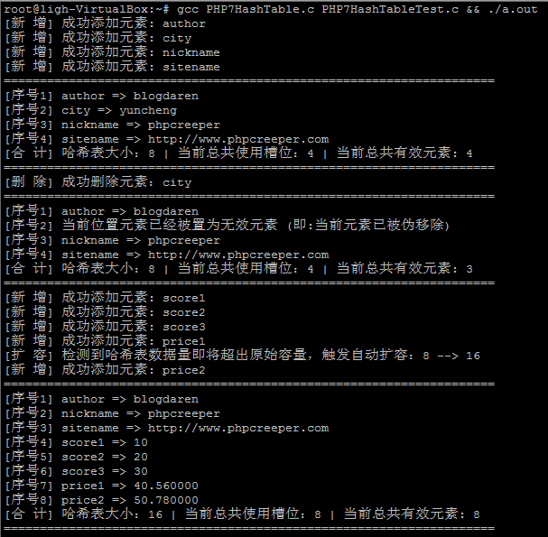

## PHP7HashTable
A equivalent official implementation For PHP7 Internal HashTable
【实战PHP7内核之哈希表官方实现】

## HashTable Data Layout
                 +=============================+
                 | HT_IDX(ht, hN)              |
                 | ...                         |
                 | HT_IDX(ht, h2)              |
                 | HT_IDX(ht, h1)              |
                 +-----------------------------+
                 | Bucket[0]                   | <---- ht->arData
                 | Bucket[1]                   |
                 | ...                         |
                 | Bucket[ht->tableSize - 1]   |
                 +=============================+

## Testing Screenshot

